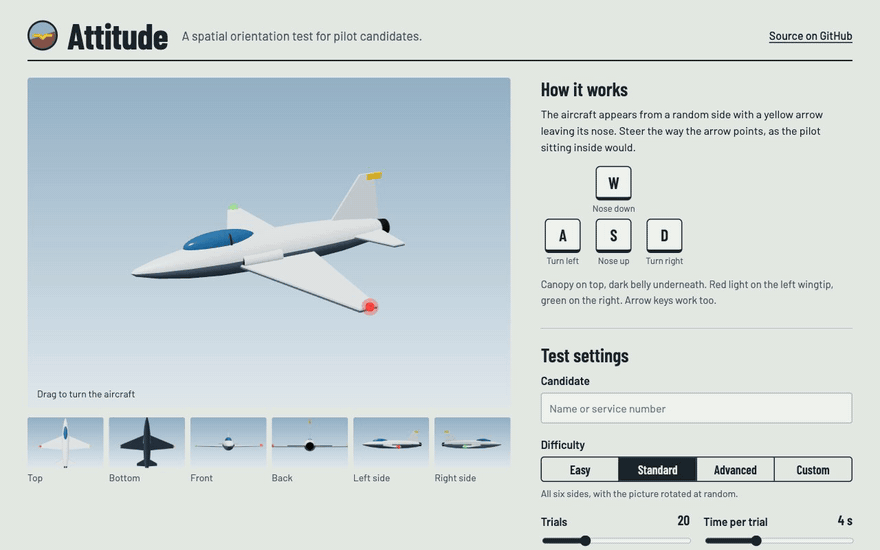
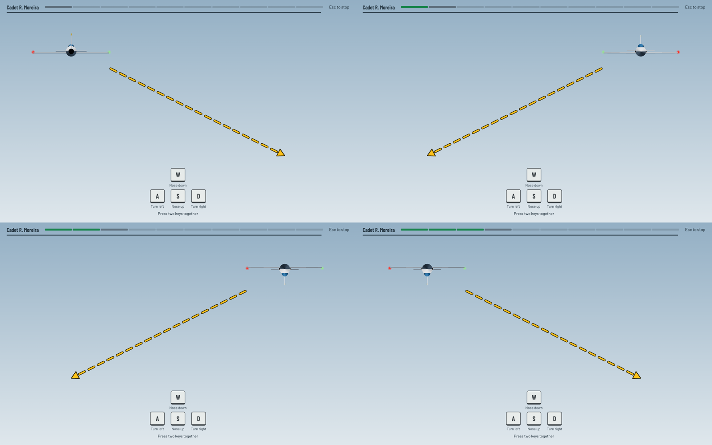
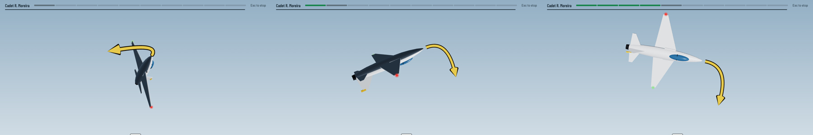
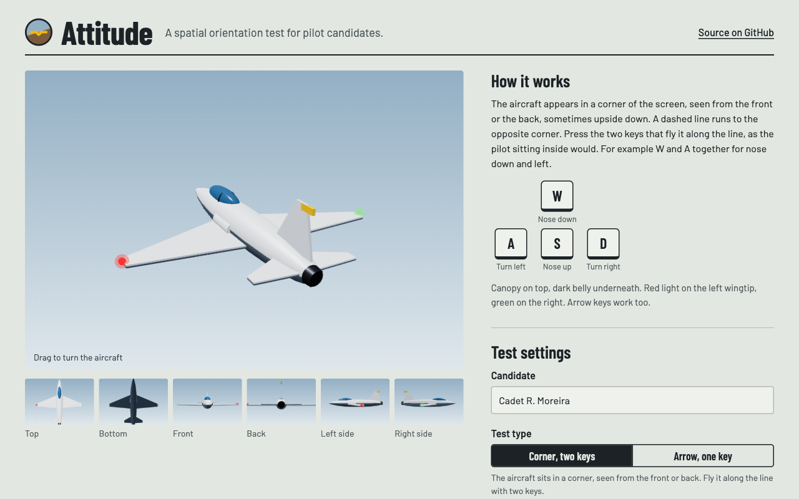
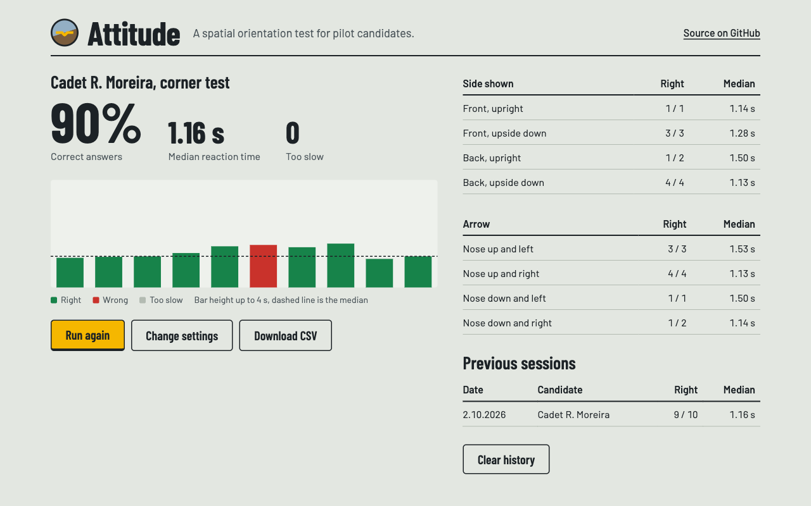

<h1>
  
  Attitude
</h1>

A spatial orientation test for pilot candidates. It runs in the browser.

An aircraft appears in a corner of the screen, seen from the front or the back and sometimes upside down.
A dashed line runs diagonally to the opposite corner. The candidate presses the two keys that would fly it along that line,
as the pilot sitting inside would. For example W + A for nose down and left.

**[Try it online](https://duartesantos8.github.io/pilot-test/)**



## Why

Aircrew selection tests check whether someone can tell how an aircraft is oriented, even when they see it from outside and rotated,
and can work out which control input it needs. This project does that one task with a keyboard instead of a joystick.
Every answer is timed and recorded.

## Two test types

### Corner, two keys (default)



1. A crosshair shows for a moment so every trial starts the same way.
2. The aircraft appears in a corner, seen from the **front or the back**, upright or **upside down**.
   A dashed line runs to the opposite corner.
3. The candidate presses **one up/down key and one left/right key together**. The answer and the reaction time are recorded.

The trick is that the screen and the aircraft disagree. Seen from the front, the aircraft's left is on your right.
Upside down, its "up" is your "down". A line going down and left on screen can mean nose up and right for the pilot.

Letting go of a single key before pressing the second one counts as an answer, and it is wrong.
So is pressing W + S or A + D. On touch screens, tap the two keys one after the other.

Options: start only from the top corners (the line always goes down), or from any corner. Upside-down pictures can be turned off.

### Arrow, one key



The aircraft appears from any of the six sides, rotated, with a curved yellow arrow leaving its nose. The candidate presses the one key for that direction.
This type has its own difficulty levels (see below).

### Reading the aircraft

- The **canopy** is on top. **Top surfaces are light** and the **belly is dark**.
- **Red** light on the **left** wingtip, **green** on the **right**, like real navigation lights.
- Directions are always relative to the aircraft, not the screen.

## Controls

| Key | Stick | Aircraft |
| --- | --- | --- |
| <kbd>W</kbd> / <kbd>↑</kbd> | forward | nose down |
| <kbd>S</kbd> / <kbd>↓</kbd> | back | nose up |
| <kbd>A</kbd> / <kbd>←</kbd> | left | turn left |
| <kbd>D</kbd> / <kbd>→</kbd> | right | turn right |

<kbd>Esc</kbd> stops the test. On a touch screen, tap the keys shown at the bottom of the screen.
Pitch can be inverted in the settings for people who think "W = up".

## Difficulty (arrow test)

| Level | Sides shown | Picture |
| --- | --- | --- |
| Easy | front and back | upright or upside down |
| Standard | all six sides | rotated to any angle |
| Advanced | angled views in between the sides | rotated to any angle |
| Custom | pick any sides | upright, upside down or any angle, angled views on or off |

Each level only shows trials where the arrow is clearly visible. "Nose up" is never shown from straight above, because the arrow would point straight at the screen.

## Settings



- **Candidate**: a name or service number, saved with the results.
- **Trials**: 5 to 60.
- **Time per trial**: 1 to 10 seconds. If no key is pressed in time, the trial counts as too slow.
- **Show right or wrong**: turn it off for a formal test, so the candidate gets no hints.
- **Sound**: short tones for right, wrong and recorded.
- **Practice 5 trials**: a warm-up with feedback that is not saved.

Settings are remembered in the browser.

## Results



- Accuracy, median reaction time (correct answers only) and the number of slow answers.
- One bar per trial: height is reaction time, colour is right, wrong or too slow.
- Breakdown by side shown (and upright or upside down in the corner test) and by direction, which shows where a candidate struggles.
- **Download CSV** gives one row per trial (`candidate, test, trial, side, picture_rotation_deg, corner, answer, response, correct, reaction_ms`), ready for a spreadsheet.
- The last sessions are listed under *Previous sessions*. This list is stored in the browser only, never sent anywhere.

## Run it locally

It's a static site with no build step. Any static file server works:

```sh
git clone https://github.com/DuarteSantos8/pilot-test.git
cd pilot-test
python3 -m http.server 8765
# open http://localhost:8765
```

Opening `index.html` straight from disk won't work, because browsers block ES modules on `file://`.
Three.js and the fonts load from a CDN, so the first load needs an internet connection.

## How it works

```
index.html        page structure: setup, test and results screens
src/aircraft.js   the jet, built from three.js primitives, and the curved arrow
src/trials.js     sides, directions, presets, trial generation, scoring
src/app.js        rendering, settings form, test flow, results, CSV
src/style.css     all styling
```

- The aircraft has its own axes: nose `+Z`, top `+Y`, pilot's left `+X`. Each answer is one of these directions: left `+X`, right `−X`, nose up `+Y`, nose down `−Y`.
- Corner test: the line's screen direction is converted into the aircraft's axes. Its left/right part becomes A or D, and its up/down part becomes W or S.
- A trial picks a camera direction (one of the six sides, nudged at random in Advanced) and a rotation of the picture around that direction.
- A trial is thrown away if the arrow points within 60° of straight at the camera or straight away from it, where it would be hard to read.
- The arrow is drawn on top of everything with a dark outline, so it stays readable against both the sky and the aircraft.

## Limitations

This is a training and screening tool, not a validated psychometric instrument. Treat the results as an indication, not a selection decision.
Reaction times depend on the keyboard and display, so compare candidates only on the same machine.
